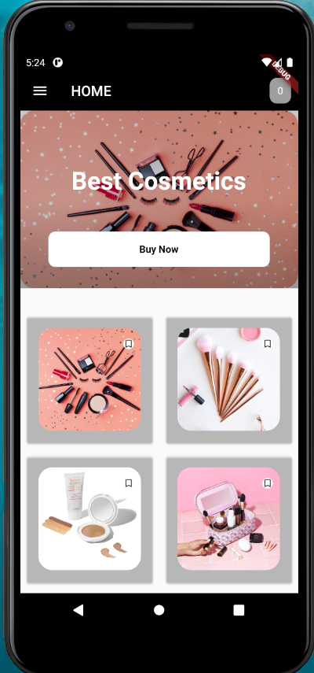
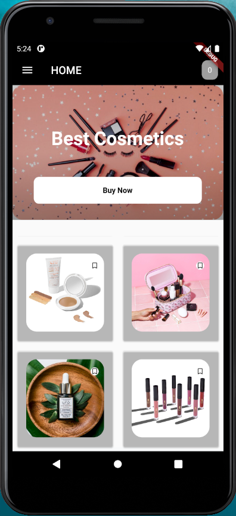

# Product_Showcase_UI using gridview

<b>Built Using:-</b>

<i><b>Flutter</b></i>

This is a single page UI and things which are used in this are:-
<ol>
  <li>MaterialApp design</li>
  <li>Scaffold class</li>
  <li>AppBar</li>
  <li>Stateless and Stateful widget.</li>
  <li>Safe Area</li>
  <li>Grid View</li>
</ol>
<b>Some Snaps from the App:-</b>

 ## Show some ❤️ and ⭐ the repo if you find it useful.
 ### Getting Started
This project is a starting point for a Flutter application.
 
A few resources to get you started if this is your first Flutter project:
<ul>
 <li>
  <a href="https://flutter.dev/docs/get-started/codelab">Lab: Write your first Flutter app</a>
 </li>
 <li>
  <a href="https://flutter.dev/docs/cookbook">Cookbook: Useful Flutter samples</a>
 </li>
 </ul>
For help getting started with Flutter, view our <a href="https://flutter.dev/docs">online documentation</a>, which offers tutorials, samples, guidance on mobile development, and a full API reference.
